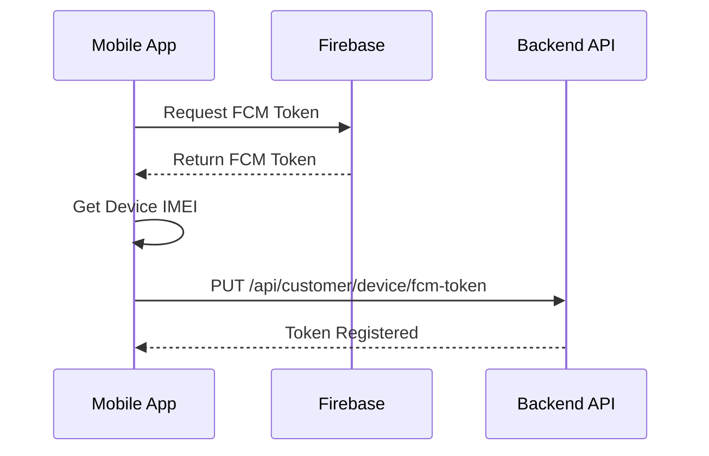
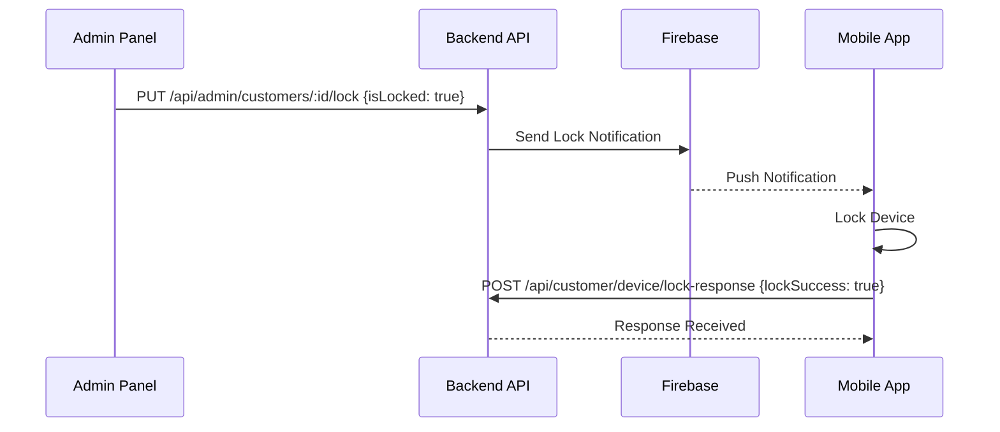

# Customer Device API Documentation

This document describes the API endpoints used by the mobile app installed on customer devices for FCM token registration, lock/unlock notifications, and device status management.

## Base URL

```
http://localhost:5000/api/customer/device
```

## Authentication

These endpoints do **NOT** require JWT authentication. They use IMEI-based identification for security.

---

## Endpoints

### 1. Register/Update FCM Token

Register or update the Firebase Cloud Messaging token for a customer device.

**Endpoint:** `PUT /api/customer/device/fcm-token`

**Request Body:**
```json
{
  "fcmToken": "string (required) - Firebase Cloud Messaging token",
  "imei1": "string (required) - 15-digit IMEI number"
}
```

**Success Response (200 OK):**
```json
{
  "success": true,
  "message": "FCM token registered successfully",
  "data": {
    "customerId": "507f1f77bcf86cd799439011",
    "customerName": "John Doe",
    "isLocked": false,
    "updatedAt": "2025-12-21T16:45:30.000Z"
  }
}
```

**Error Responses:**

- **400 Bad Request** - Validation error
```json
{
  "success": false,
  "message": "Validation failed",
  "error": "VALIDATION_ERROR",
  "details": [
    {
      "msg": "FCM token is required",
      "param": "fcmToken"
    }
  ]
}
```

- **404 Not Found** - Customer not found
```json
{
  "success": false,
  "message": "Customer not found with this IMEI",
  "error": "CUSTOMER_NOT_FOUND"
}
```

**Example (Kotlin):**
```kotlin
// Call this when the app is installed or FCM token is refreshed
suspend fun registerFcmToken(fcmToken: String, imei: String) {
    val request = JSONObject().apply {
        put("fcmToken", fcmToken)
        put("imei1", imei)
    }
    
    val response = apiClient.put(
        url = "http://your-server.com/api/customer/device/fcm-token",
        body = request
    )
    
    if (response.success) {
        Log.d("FCM", "Token registered successfully")
    }
}
```

---

### 2. Device Lock Response Callback

Called by the mobile app after attempting to lock or unlock the device in response to an FCM notification.

**Endpoint:** `POST /api/customer/device/lock-response`

**Request Body:**
```json
{
  "imei1": "string (required) - 15-digit IMEI number",
  "lockSuccess": "boolean (required) - Whether lock/unlock was successful",
  "action": "string (required) - Either 'LOCK_DEVICE' or 'UNLOCK_DEVICE'",
  "errorMessage": "string (optional) - Error message if lockSuccess is false"
}
```

**Success Response (200 OK):**
```json
{
  "success": true,
  "message": "Lock response received",
  "data": {
    "customerId": "507f1f77bcf86cd799439011",
    "customerName": "John Doe",
    "currentLockStatus": true,
    "responseProcessed": true
  }
}
```

**Error Responses:**

- **400 Bad Request** - Validation error
```json
{
  "success": false,
  "message": "Validation failed",
  "error": "VALIDATION_ERROR",
  "details": [
    {
      "msg": "action must be either LOCK_DEVICE or UNLOCK_DEVICE",
      "param": "action"
    }
  ]
}
```

- **404 Not Found** - Customer not found
```json
{
  "success": false,
  "message": "Customer not found with this IMEI",
  "error": "CUSTOMER_NOT_FOUND"
}
```

**Example (Kotlin):**
```kotlin
// Call this after attempting to lock/unlock the device
suspend fun sendLockResponse(
    imei: String,
    success: Boolean,
    action: String,
    errorMessage: String? = null
) {
    val request = JSONObject().apply {
        put("imei1", imei)
        put("lockSuccess", success)
        put("action", action)
        errorMessage?.let { put("errorMessage", it) }
    }
    
    val response = apiClient.post(
        url = "http://your-server.com/api/customer/device/lock-response",
        body = request
    )
    
    Log.d("LockResponse", "Response sent: ${response.success}")
}
```

---

### 3. Get Customer Status

Get the current lock status and pending EMI information for a customer device.

**Endpoint:** `GET /api/customer/device/status/:imei1`

**URL Parameters:**
- `imei1` (required) - 15-digit IMEI number

**Success Response (200 OK):**
```json
{
  "success": true,
  "message": "Customer status fetched successfully",
  "data": {
    "customerId": "507f1f77bcf86cd799439011",
    "customerName": "John Doe",
    "mobileNumber": "9876543210",
    "isLocked": false,
    "hasPendingEmis": true,
    "pendingEmiCount": 2,
    "registeredAt": "2025-01-15T10:30:00.000Z",
    "lastUpdated": "2025-12-21T16:45:30.000Z"
  }
}
```

**Error Responses:**

- **400 Bad Request** - Invalid IMEI format
```json
{
  "success": false,
  "message": "Invalid IMEI format. Must be exactly 15 digits",
  "error": "VALIDATION_ERROR"
}
```

- **404 Not Found** - Customer not found
```json
{
  "success": false,
  "message": "Customer not found with this IMEI",
  "error": "CUSTOMER_NOT_FOUND"
}
```

**Example (Kotlin):**
```kotlin
// Call this periodically to check device status
suspend fun checkDeviceStatus(imei: String): DeviceStatus? {
    val response = apiClient.get(
        url = "http://your-server.com/api/customer/device/status/$imei"
    )
    
    return if (response.success) {
        DeviceStatus(
            isLocked = response.data.getBoolean("isLocked"),
            hasPendingEmis = response.data.getBoolean("hasPendingEmis"),
            pendingEmiCount = response.data.getInt("pendingEmiCount")
        )
    } else {
        null
    }
}
```

---

## FCM Notification Payload

When the admin locks or unlocks a customer, the backend sends an FCM notification with the following structure:

**Notification:**
```json
{
  "title": "Device Lock Alert" or "Device Unlock Alert",
  "body": "Your device has been locked due to pending EMI payments." or "Your device has been unlocked. Thank you for your payment."
}
```

**Data Payload:**
```json
{
  "action": "LOCK_DEVICE" or "UNLOCK_DEVICE",
  "timestamp": "2025-12-21T16:45:30.000Z",
  "type": "DEVICE_LOCK_STATUS"
}
```

**Example (Kotlin - FCM Service):**
```kotlin
class MyFirebaseMessagingService : FirebaseMessagingService() {
    
    override fun onMessageReceived(remoteMessage: RemoteMessage) {
        val data = remoteMessage.data
        
        when (data["type"]) {
            "DEVICE_LOCK_STATUS" -> {
                val action = data["action"]
                handleLockAction(action)
            }
        }
    }
    
    private fun handleLockAction(action: String?) {
        when (action) {
            "LOCK_DEVICE" -> {
                val success = lockDevice()
                sendLockResponse(
                    imei = getDeviceImei(),
                    success = success,
                    action = "LOCK_DEVICE",
                    errorMessage = if (!success) "Failed to lock device" else null
                )
            }
            "UNLOCK_DEVICE" -> {
                val success = unlockDevice()
                sendLockResponse(
                    imei = getDeviceImei(),
                    success = success,
                    action = "UNLOCK_DEVICE",
                    errorMessage = if (!success) "Failed to unlock device" else null
                )
            }
        }
    }
    
    override fun onNewToken(token: String) {
        // Register new FCM token with backend
        CoroutineScope(Dispatchers.IO).launch {
            registerFcmToken(token, getDeviceImei())
        }
    }
}
```

---

## Integration Flow

### 1. App Installation Flow



### 2. Device Lock Flow



---

## Error Handling

The mobile app should handle the following scenarios:

1. **No Internet Connection**: Queue the FCM token registration and lock responses for retry when connection is restored
2. **Invalid IMEI**: Ensure IMEI is exactly 15 digits before making API calls
3. **FCM Token Refresh**: Re-register the token whenever Firebase provides a new one
4. **Lock Failure**: Send lock response with `lockSuccess: false` and include error message
5. **Server Unreachable**: Implement exponential backoff for retries

---

## Security Considerations

1. **IMEI Validation**: All endpoints validate IMEI format (exactly 15 digits)
2. **No Authentication Required**: These endpoints are designed for device-level access without user authentication
3. **Rate Limiting**: Standard rate limiting applies to prevent abuse
4. **HTTPS Only**: In production, ensure all API calls use HTTPS
5. **FCM Token Security**: Never expose FCM tokens in logs or error messages

---

## Testing

### Test FCM Token Registration

```bash
curl -X PUT http://localhost:5000/api/customer/device/fcm-token \
  -H "Content-Type: application/json" \
  -d '{
    "fcmToken": "test-fcm-token-123456",
    "imei1": "123456789012345"
  }'
```

### Test Lock Response

```bash
curl -X POST http://localhost:5000/api/customer/device/lock-response \
  -H "Content-Type: application/json" \
  -d '{
    "imei1": "123456789012345",
    "lockSuccess": true,
    "action": "LOCK_DEVICE"
  }'
```

### Test Get Status

```bash
curl -X GET http://localhost:5000/api/customer/device/status/123456789012345
```
