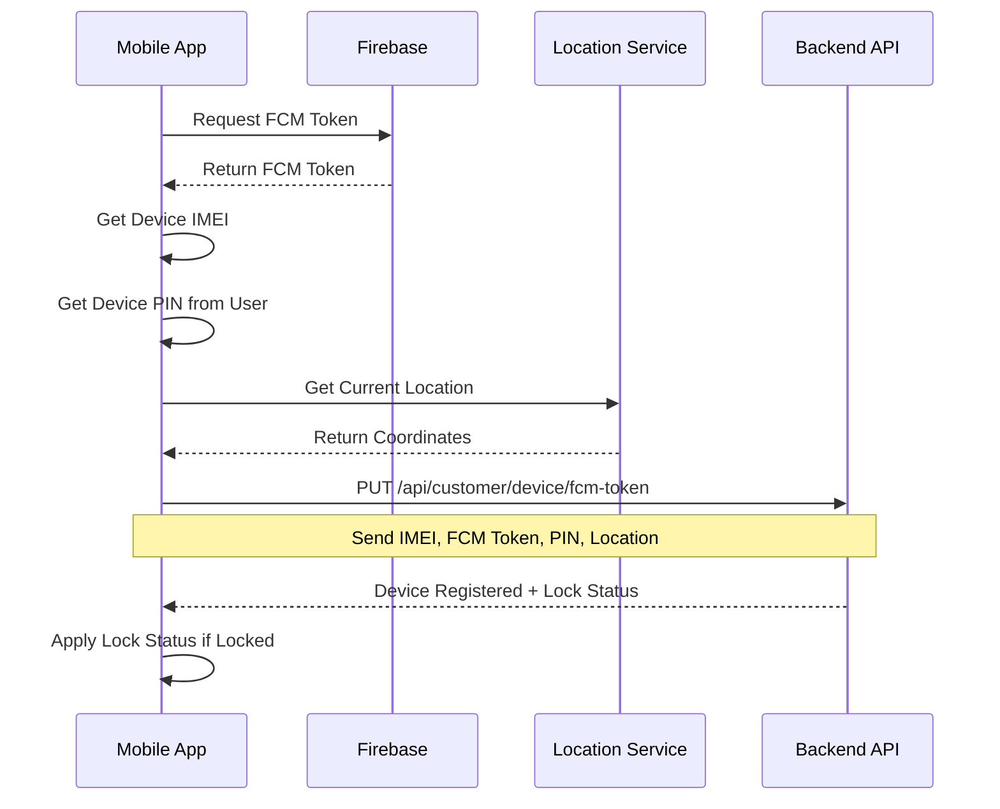
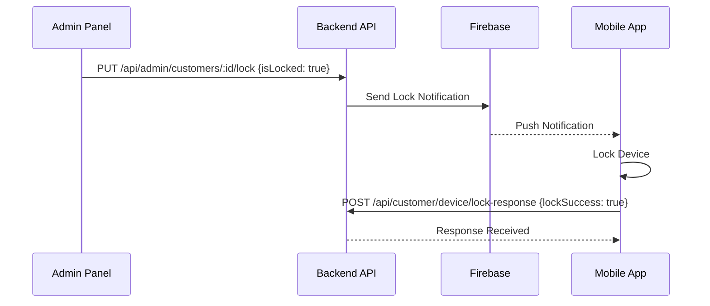
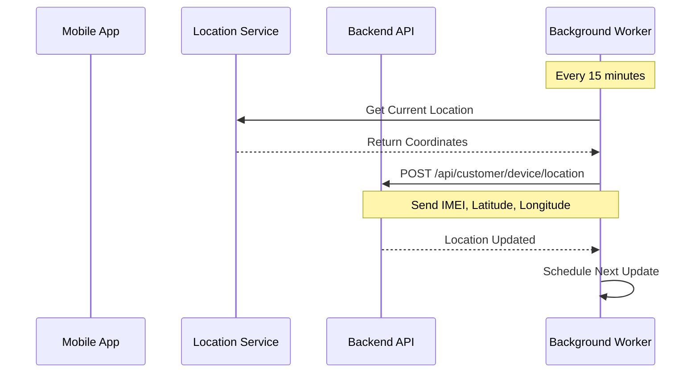

# Customer Device API Documentation

This document describes the API endpoints used by the mobile app installed on customer devices for device registration (IMEI, FCM token, PIN, location), lock/unlock notifications, location tracking, and device status management.

## Base URL

```
http://localhost:5000/api/customer/device
```

## Authentication

These endpoints do **NOT** require JWT authentication. They use IMEI-based identification for security.

---

## Endpoints

### 1. Register/Update FCM Token

Register or update the Firebase Cloud Messaging token for a customer device. Also accepts optional device PIN and location for complete device registration when the app is first installed.

**Endpoint:** `PUT /api/customer/device/fcm-token`

**Request Body:**
```json
{
  "fcmToken": "string (required) - Firebase Cloud Messaging token",
  "imei1": "string (required) - 15-digit IMEI number",
  "devicePin": "string (optional) - 4-6 digit device PIN",
  "latitude": "number (optional) - Device latitude (-90 to 90)",
  "longitude": "number (optional) - Device longitude (-180 to 180)"
}
```

**Success Response (200 OK):**
```json
{
  "success": true,
  "message": "FCM token registered successfully",
  "data": {
    "customerId": "507f1f77bcf86cd799439011",
    "customerName": "John Doe",
    "isLocked": false,
    "location": {
      "latitude": 28.7041,
      "longitude": 77.1025,
      "lastUpdated": "2025-12-22T14:45:30.000Z"
    },
    "updatedAt": "2025-12-22T14:45:30.000Z"
  }
}
```

> **Note**: The `location` field in the response is only included if location data was provided and stored.

**Error Responses:**

- **400 Bad Request** - Validation error
```json
{
  "success": false,
  "message": "Validation failed",
  "error": "VALIDATION_ERROR",
  "details": [
    {
      "msg": "Device PIN must be 4-6 digits",
      "param": "devicePin"
    }
  ]
}
```

- **404 Not Found** - Customer not found
```json
{
  "success": false,
  "message": "Customer not found with this IMEI",
  "error": "CUSTOMER_NOT_FOUND"
}
```

**Example (Kotlin - Complete Registration):**
```kotlin
// Call this when the app is first installed with all fields
suspend fun registerDevice(
    fcmToken: String,
    imei: String,
    devicePin: String,
    latitude: Double,
    longitude: Double
) {
    val request = JSONObject().apply {
        put("fcmToken", fcmToken)
        put("imei1", imei)
        put("devicePin", devicePin)
        put("latitude", latitude)
        put("longitude", longitude)
    }
    
    val response = apiClient.put(
        url = "http://your-server.com/api/customer/device/fcm-token",
        body = request
    )
    
    if (response.success) {
        Log.d("Registration", "Device registered successfully")
        val isLocked = response.data.getBoolean("isLocked")
        if (isLocked) {
            lockDevice()
        }
    }
}
```

**Example (Kotlin - FCM Token Update Only):**
```kotlin
// Call this when only FCM token needs to be updated
suspend fun updateFcmToken(fcmToken: String, imei: String) {
    val request = JSONObject().apply {
        put("fcmToken", fcmToken)
        put("imei1", imei)
    }
    
    val response = apiClient.put(
        url = "http://your-server.com/api/customer/device/fcm-token",
        body = request
    )
}
```

---

### 2. Device Lock Response Callback

Called by the mobile app after attempting to lock or unlock the device in response to an FCM notification.

**Endpoint:** `POST /api/customer/device/lock-response`

**Request Body:**
```json
{
  "imei1": "string (required) - 15-digit IMEI number",
  "lockSuccess": "boolean (required) - Whether lock/unlock was successful",
  "action": "string (required) - Either 'LOCK_DEVICE' or 'UNLOCK_DEVICE'",
  "errorMessage": "string (optional) - Error message if lockSuccess is false"
}
```

**Success Response (200 OK):**
```json
{
  "success": true,
  "message": "Lock response received",
  "data": {
    "customerId": "507f1f77bcf86cd799439011",
    "customerName": "John Doe",
    "currentLockStatus": true,
    "responseProcessed": true
  }
}
```

**Error Responses:**

- **400 Bad Request** - Validation error
```json
{
  "success": false,
  "message": "Validation failed",
  "error": "VALIDATION_ERROR",
  "details": [
    {
      "msg": "action must be either LOCK_DEVICE or UNLOCK_DEVICE",
      "param": "action"
    }
  ]
}
```

- **404 Not Found** - Customer not found
```json
{
  "success": false,
  "message": "Customer not found with this IMEI",
  "error": "CUSTOMER_NOT_FOUND"
}
```

**Example (Kotlin):**
```kotlin
// Call this after attempting to lock/unlock the device
suspend fun sendLockResponse(
    imei: String,
    success: Boolean,
    action: String,
    errorMessage: String? = null
) {
    val request = JSONObject().apply {
        put("imei1", imei)
        put("lockSuccess", success)
        put("action", action)
        errorMessage?.let { put("errorMessage", it) }
    }
    
    val response = apiClient.post(
        url = "http://your-server.com/api/customer/device/lock-response",
        body = request
    )
    
    Log.d("LockResponse", "Response sent: ${response.success}")
}
```

---

### 3. Get Customer Status

Get the current lock status and pending EMI information for a customer device.

**Endpoint:** `GET /api/customer/device/status/:imei1`

**URL Parameters:**
- `imei1` (required) - 15-digit IMEI number

**Success Response (200 OK):**
```json
{
  "success": true,
  "message": "Customer status fetched successfully",
  "data": {
    "customerId": "507f1f77bcf86cd799439011",
    "customerName": "John Doe",
    "mobileNumber": "9876543210",
    "isLocked": false,
    "hasPendingEmis": true,
    "pendingEmiCount": 2,
    "registeredAt": "2025-01-15T10:30:00.000Z",
    "lastUpdated": "2025-12-21T16:45:30.000Z"
  }
}
```

**Error Responses:**

- **400 Bad Request** - Invalid IMEI format
```json
{
  "success": false,
  "message": "Invalid IMEI format. Must be exactly 15 digits",
  "error": "VALIDATION_ERROR"
}
```

- **404 Not Found** - Customer not found
```json
{
  "success": false,
  "message": "Customer not found with this IMEI",
  "error": "CUSTOMER_NOT_FOUND"
}
```

**Example (Kotlin):**
```kotlin
// Call this periodically to check device status
suspend fun checkDeviceStatus(imei: String): DeviceStatus? {
    val response = apiClient.get(
        url = "http://your-server.com/api/customer/device/status/$imei"
    )
    
    return if (response.success) {
        DeviceStatus(
            isLocked = response.data.getBoolean("isLocked"),
            hasPendingEmis = response.data.getBoolean("hasPendingEmis"),
            pendingEmiCount = response.data.getInt("pendingEmiCount")
        )
    } else {
        null
    }
}
```

---

### 4. Get Customer Location

Fetch the current location of a customer device by IMEI.

**Endpoint:** `GET /api/customer/device/location/:imei1`

**URL Parameters:**
- `imei1` (required) - 15-digit IMEI number

**Success Response (200 OK):**
```json
{
  "success": true,
  "message": "Customer location fetched successfully",
  "data": {
    "customerId": "507f1f77bcf86cd799439011",
    "customerName": "John Doe",
    "mobileNumber": "9876543210",
    "location": {
      "latitude": 28.7041,
      "longitude": 77.1025,
      "lastUpdated": "2025-12-22T14:30:00.000Z"
    }
  }
}
```

**Error Responses:**

- **400 Bad Request** - Invalid IMEI format
```json
{
  "success": false,
  "message": "Invalid IMEI format. Must be exactly 15 digits",
  "error": "VALIDATION_ERROR"
}
```

- **404 Not Found** - Customer not found
```json
{
  "success": false,
  "message": "Customer not found with this IMEI",
  "error": "CUSTOMER_NOT_FOUND"
}
```

- **404 Not Found** - Location not available
```json
{
  "success": false,
  "message": "Location data not available for this customer",
  "error": "LOCATION_NOT_FOUND"
}
```

**Example (Kotlin):**
```kotlin
// Fetch current device location from server
suspend fun getDeviceLocation(imei: String): Location? {
    val response = apiClient.get(
        url = "http://your-server.com/api/customer/device/location/$imei"
    )
    
    return if (response.success) {
        val locationData = response.data.getJSONObject("location")
        Location(
            latitude = locationData.getDouble("latitude"),
            longitude = locationData.getDouble("longitude"),
            lastUpdated = locationData.getString("lastUpdated")
        )
    } else {
        null
    }
}
```

---

### 5. Update Customer Location

Update the current location of a customer device. The Kotlin app should call this endpoint every 15 minutes.

**Endpoint:** `POST /api/customer/device/location`

**Request Body:**
```json
{
  "imei1": "string (required) - 15-digit IMEI number",
  "latitude": "number (required) - Device latitude (-90 to 90)",
  "longitude": "number (required) - Device longitude (-180 to 180)"
}
```

**Success Response (200 OK):**
```json
{
  "success": true,
  "message": "Location updated successfully",
  "data": {
    "customerId": "507f1f77bcf86cd799439011",
    "customerName": "John Doe",
    "location": {
      "latitude": 28.7041,
      "longitude": 77.1025,
      "lastUpdated": "2025-12-22T14:45:30.000Z"
    }
  }
}
```

**Error Responses:**

- **400 Bad Request** - Validation error
```json
{
  "success": false,
  "message": "Validation failed",
  "error": "VALIDATION_ERROR",
  "details": [
    {
      "msg": "Latitude must be between -90 and 90",
      "param": "latitude"
    }
  ]
}
```

- **404 Not Found** - Customer not found
```json
{
  "success": false,
  "message": "Customer not found with this IMEI",
  "error": "CUSTOMER_NOT_FOUND"
}
```

**Example (Kotlin):**
```kotlin
// Update device location every 15 minutes
class LocationUpdateWorker(context: Context, params: WorkerParameters) : CoroutineWorker(context, params) {
    
    override suspend fun doWork(): Result {
        val location = getCurrentLocation() ?: return Result.retry()
        
        val request = JSONObject().apply {
            put("imei1", getDeviceImei())
            put("latitude", location.latitude)
            put("longitude", location.longitude)
        }
        
        return try {
            val response = apiClient.post(
                url = "http://your-server.com/api/customer/device/location",
                body = request
            )
            
            if (response.success) {
                Log.d("Location", "Location updated successfully")
                Result.success()
            } else {
                Result.retry()
            }
        } catch (e: Exception) {
            Log.e("Location", "Failed to update location", e)
            Result.retry()
        }
    }
}

// Schedule periodic location updates
fun scheduleLocationUpdates(context: Context) {
    val locationUpdateRequest = PeriodicWorkRequestBuilder<LocationUpdateWorker>(
        15, TimeUnit.MINUTES
    ).build()
    
    WorkManager.getInstance(context).enqueueUniquePeriodicWork(
        "location_update",
        ExistingPeriodicWorkPolicy.KEEP,
        locationUpdateRequest
    )
}
```

---

## FCM Notification Payload

When the admin locks or unlocks a customer, the backend sends an FCM notification with the following structure:

**Notification:**
```json
{
  "title": "Device Lock Alert" or "Device Unlock Alert",
  "body": "Your device has been locked due to pending EMI payments." or "Your device has been unlocked. Thank you for your payment."
}
```

**Data Payload:**
```json
{
  "action": "LOCK_DEVICE" or "UNLOCK_DEVICE",
  "timestamp": "2025-12-21T16:45:30.000Z",
  "type": "DEVICE_LOCK_STATUS"
}
```

**Example (Kotlin - FCM Service):**
```kotlin
class MyFirebaseMessagingService : FirebaseMessagingService() {
    
    override fun onMessageReceived(remoteMessage: RemoteMessage) {
        val data = remoteMessage.data
        
        when (data["type"]) {
            "DEVICE_LOCK_STATUS" -> {
                val action = data["action"]
                handleLockAction(action)
            }
        }
    }
    
    private fun handleLockAction(action: String?) {
        when (action) {
            "LOCK_DEVICE" -> {
                val success = lockDevice()
                sendLockResponse(
                    imei = getDeviceImei(),
                    success = success,
                    action = "LOCK_DEVICE",
                    errorMessage = if (!success) "Failed to lock device" else null
                )
            }
            "UNLOCK_DEVICE" -> {
                val success = unlockDevice()
                sendLockResponse(
                    imei = getDeviceImei(),
                    success = success,
                    action = "UNLOCK_DEVICE",
                    errorMessage = if (!success) "Failed to unlock device" else null
                )
            }
        }
    }
    
    override fun onNewToken(token: String) {
        // Register new FCM token with backend
        CoroutineScope(Dispatchers.IO).launch {
            registerFcmToken(token, getDeviceImei())
        }
    }
}
```

---

## EMI Reminder Notification Payload

When the admin sends an EMI reminder notification, the backend sends an FCM notification with the following structure:

**Notification:**
```json
{
  "title": "EMI Payment Reminder",
  "body": "Dear John Doe, you have 2 pending EMI payment(s) totaling ₹6000. Please pay at the earliest."
}
```

**Data Payload:**
```json
{
  "type": "EMI_REMINDER",
  "pendingCount": "2",
  "totalPendingAmount": "6000",
  "customerId": "507f1f77bcf86cd799439011",
  "timestamp": "2025-12-22T15:30:00.000Z"
}
```

**Example (Kotlin - Enhanced FCM Service):**
```kotlin
class MyFirebaseMessagingService : FirebaseMessagingService() {
    
    override fun onMessageReceived(remoteMessage: RemoteMessage) {
        val data = remoteMessage.data
        val notification = remoteMessage.notification
        
        when (data["type"]) {
            "DEVICE_LOCK_STATUS" -> {
                val action = data["action"]
                handleLockAction(action)
            }
            "EMI_REMINDER" -> {
                val pendingCount = data["pendingCount"]?.toIntOrNull() ?: 0
                val totalAmount = data["totalPendingAmount"]?.toIntOrNull() ?: 0
                
                // Show notification to user
                showEmiReminderNotification(
                    title = notification?.title ?: "EMI Payment Reminder",
                    message = notification?.body ?: "You have pending EMI payments",
                    pendingCount = pendingCount,
                    totalAmount = totalAmount
                )
                
                Log.d("EMI_REMINDER", "Pending: $pendingCount, Amount: ₹$totalAmount")
            }
        }
    }
    
    private fun handleLockAction(action: String?) {
        when (action) {
            "LOCK_DEVICE" -> {
                val success = lockDevice()
                sendLockResponse(
                    imei = getDeviceImei(),
                    success = success,
                    action = "LOCK_DEVICE",
                    errorMessage = if (!success) "Failed to lock device" else null
                )
            }
            "UNLOCK_DEVICE" -> {
                val success = unlockDevice()
                sendLockResponse(
                    imei = getDeviceImei(),
                    success = success,
                    action = "UNLOCK_DEVICE",
                    errorMessage = if (!success) "Failed to unlock device" else null
                )
            }
        }
    }
    
    private fun showEmiReminderNotification(
        title: String,
        message: String,
        pendingCount: Int,
        totalAmount: Int
    ) {
        val notificationManager = getSystemService(Context.NOTIFICATION_SERVICE) as NotificationManager
        
        val notification = NotificationCompat.Builder(this, CHANNEL_ID)
            .setSmallIcon(R.drawable.ic_notification)
            .setContentTitle(title)
            .setContentText(message)
            .setStyle(NotificationCompat.BigTextStyle().bigText(message))
            .setPriority(NotificationCompat.PRIORITY_HIGH)
            .setAutoCancel(true)
            .build()
        
        notificationManager.notify(NOTIFICATION_ID_EMI, notification)
    }
    
    override fun onNewToken(token: String) {
        // Register new FCM token with backend
        CoroutineScope(Dispatchers.IO).launch {
            registerFcmToken(token, getDeviceImei())
        }
    }
}
```

---

## Admin EMI Reminder API

This section documents how the admin sends EMI payment reminders to customer devices.

### Send EMI Reminder (Admin Endpoint)

**Endpoint:** `POST /api/admin/customers/emi-reminder`  
**Authentication:** Required (Admin JWT token)  
**Purpose:** Admin sends FCM notification to customer device for pending EMI payment reminder

> **Note:** This is an admin-only endpoint. The Kotlin app receives the notification via FCM.

**Request Headers:**
```
Authorization: Bearer <admin_jwt_token>
Content-Type: application/json
```

**Request Body:**
```json
{
  "customerId": "507f1f77bcf86cd799439011",
  "imei1": "123456789012345",
  "message": "Please pay your pending EMI at the earliest"
}
```

**Field Descriptions:**
- `customerId` (optional): MongoDB ObjectId of the customer - use either this or imei1
- `imei1` (optional): 15-digit IMEI number - use either this or customerId
- `message` (optional): Custom reminder message. If not provided, a default message will be generated

**Success Response (200 OK):**
```json
{
  "success": true,
  "message": "EMI reminder notification sent successfully",
  "data": {
    "customerId": "507f1f77bcf86cd799439011",
    "customerName": "John Doe",
    "mobileNumber": "9876543210",
    "pendingEmisCount": 2,
    "totalPendingAmount": 6000,
    "notificationSent": true,
    "messageId": "projects/your-project/messages/0:1234567890"
  }
}
```

**Error Responses:**

- **400 Bad Request** - Missing required fields
```json
{
  "success": false,
  "message": "Either customerId or imei1 is required",
  "error": "VALIDATION_ERROR"
}
```

- **400 Bad Request** - No FCM token
```json
{
  "success": false,
  "message": "Customer device is not registered. No FCM token available.",
  "error": "NO_FCM_TOKEN"
}
```

- **404 Not Found** - Customer not found
```json
{
  "success": false,
  "message": "Customer not found",
  "error": "CUSTOMER_NOT_FOUND"
}
```

**What the Kotlin App Receives:**

When admin sends an EMI reminder, the device receives an FCM notification (see [EMI Reminder Notification Payload](#emi-reminder-notification-payload) section above for handling details).

**Example Admin Request:**
```bash
curl -X POST http://localhost:5000/api/admin/customers/emi-reminder \
  -H "Authorization: Bearer <admin_token>" \
  -H "Content-Type: application/json" \
  -d '{
    "imei1": "123456789012345",
    "message": "Dear customer, please pay your pending EMI"
  }'
```

---

## Admin Lock/Unlock API

This section documents how the admin locks or unlocks customer devices.

### Lock/Unlock Customer Device (Admin Endpoint)

**Endpoint:** `PUT /api/admin/customers/:customerId/lock`  
**Authentication:** Required (Admin JWT token)  
**Purpose:** Admin locks or unlocks a customer device by sending FCM notification

> **Note:** This is an admin-only endpoint. The Kotlin app receives the lock command via FCM and responds via the `/api/customer/device/lock-response` endpoint.

**Request Headers:**
```
Authorization: Bearer <admin_jwt_token>
Content-Type: application/json
```

**URL Parameters:**
- `customerId` (required) - MongoDB ObjectId of the customer

**Request Body:**
```json
{
  "isLocked": true
}
```

**Field Descriptions:**
- `isLocked` (required): `true` to lock the device, `false` to unlock

**Success Response (200 OK) - With FCM Token:**
```json
{
  "success": true,
  "message": "Lock notification sent to John Doe. Waiting for device confirmation.",
  "data": {
    "customerId": "507f1f77bcf86cd799439011",
    "customerName": "John Doe",
    "currentLockStatus": false,
    "requestedLockStatus": true,
    "lockStatusUpdated": false,
    "notificationSent": true,
    "pendingDeviceConfirmation": true,
    "updatedAt": "2025-12-24T01:14:42.000Z"
  }
}
```

**Error Response (400 Bad Request) - No FCM Token:**
```json
{
  "success": false,
  "message": "Cannot lock device. Customer device is not registered.",
  "error": "NO_FCM_TOKEN",
  "data": {
    "customerId": "507f1f77bcf86cd799439011",
    "customerName": "John Doe",
    "currentLockStatus": false,
    "hasFcmToken": false,
    "reason": "Device must install and register the mobile app with FCM token before it can be locked/unlocked"
  }
}
```

**Response Fields Explained:**

| Field | Type | Description |
|-------|------|-------------|
| `currentLockStatus` | boolean | **Current** database value (actual device state NOW) |
| `requestedLockStatus` | boolean | What the admin **requested** (lock or unlock) |
| `lockStatusUpdated` | boolean | Was the database updated immediately? |
| `pendingDeviceConfirmation` | boolean | Is it waiting for device to confirm? |
| `notificationSent` | boolean | Was FCM notification sent successfully? |
| `notificationError` | string? | Error message if notification failed |

**Frontend UI Logic:**

The admin panel should use this logic to update the UI:

1. **If `pendingDeviceConfirmation === true`**: 
   - Show "Locking..." or "Pending" state (NOT "Locked")
   - Poll the customer API to check when device confirms
   
2. **If `lockStatusUpdated === true`**: 
   - Use `currentLockStatus` to show locked/unlocked state
   - No polling needed
   
3. **If error `NO_FCM_TOKEN`**: 
   - Show error: "Device not registered. Cannot lock."
   - Keep old state
   
4. **If `notificationError` exists**: 
   - Show error message
   - Keep old state (`currentLockStatus`)

**Error Responses:**

- **400 Bad Request** - Validation error
```json
{
  "success": false,
  "message": "isLocked status is required and must be a boolean",
  "error": "VALIDATION_ERROR"
}
```

- **400 Bad Request** - No FCM token (shown above)

- **404 Not Found** - Customer not found
```json
{
  "success": false,
  "message": "Customer not found",
  "error": "CUSTOMER_NOT_FOUND"
}
```

**Example Admin Request:**
```bash
# Lock a customer
curl -X PUT http://localhost:5000/api/admin/customers/507f1f77bcf86cd799439011/lock \
  -H "Authorization: Bearer <admin_token>" \
  -H "Content-Type: application/json" \
  -d '{
    "isLocked": true
  }'

# Unlock a customer
curl -X PUT http://localhost:5000/api/admin/customers/507f1f77bcf86cd799439011/lock \
  -H "Authorization: Bearer <admin_token>" \
  -H "Content-Type: application/json" \
  -d '{
    "isLocked": false
  }'
```

**What Happens Next:**

1. **If device has FCM token**:
   - Backend sends FCM notification to device
   - Database is **NOT** updated immediately
   - Device receives notification and attempts to lock
   - Device calls `/api/customer/device/lock-response` with result
   - Database is updated **only if device confirms success**

2. **If device has NO FCM token**:
   - Returns **400 error** with `NO_FCM_TOKEN`
   - Database is **NOT** updated
   - Admin sees error message

**Admin Panel Polling Example:**

When `pendingDeviceConfirmation === true`, poll for updates:

```javascript
// Poll every 2 seconds to check if device confirmed
const pollInterval = setInterval(async () => {
  const customer = await fetchCustomer(customerId);
  
  if (customer.isLocked === requestedLockStatus) {
    // Device confirmed!
    setLockState(customer.isLocked ? 'locked' : 'unlocked');
    clearInterval(pollInterval);
  }
}, 2000);

// Stop polling after 30 seconds
setTimeout(() => {
  clearInterval(pollInterval);
  showError('Device did not respond in time');
}, 30000);
```

---

### Check Customer Lock Status (Admin Endpoint)

**Endpoint:** `GET /api/admin/customers/:customerId/lock-status`  
**Authentication:** Required (Admin JWT token)  
**Purpose:** Check the current lock status of a customer from the database

> **Note:** Use this endpoint to verify if the device was actually locked after sending a lock command. This is independent of the device callback.

**Request Headers:**
```
Authorization: Bearer <admin_jwt_token>
```

**URL Parameters:**
- `customerId` (required) - MongoDB ObjectId of the customer

**Success Response (200 OK):**
```json
{
  "success": true,
  "message": "Customer lock status fetched successfully",
  "data": {
    "customerId": "507f1f77bcf86cd799439011",
    "customerName": "John Doe",
    "mobileNumber": "9876543210",
    "isLocked": true,
    "hasFcmToken": true,
    "lastUpdated": "2025-12-24T01:25:00.000Z"
  }
}
```

**Response Fields:**

| Field | Type | Description |
|-------|------|-------------|
| `isLocked` | boolean | Current lock status in database |
| `hasFcmToken` | boolean | Whether customer has FCM token registered |
| `lastUpdated` | string | When the customer record was last updated |

**Error Responses:**

- **400 Bad Request** - Invalid customer ID
```json
{
  "success": false,
  "message": "Invalid customer ID format",
  "error": "VALIDATION_ERROR"
}
```

- **404 Not Found** - Customer not found
```json
{
  "success": false,
  "message": "Customer not found",
  "error": "CUSTOMER_NOT_FOUND"
}
```

**Example Request:**
```bash
curl -X GET http://localhost:5000/api/admin/customers/507f1f77bcf86cd799439011/lock-status \
  -H "Authorization: Bearer <admin_token>"
```

**Usage Pattern:**

After sending a lock command, poll this endpoint to check if the device was actually locked:

```javascript
// Send lock command
const lockResponse = await lockCustomer(customerId, true);

if (lockResponse.data.pendingDeviceConfirmation) {
  // Poll for status updates
  const checkInterval = setInterval(async () => {
    const status = await fetch(`/api/admin/customers/${customerId}/lock-status`, {
      headers: { 'Authorization': `Bearer ${token}` }
    });
    const data = await status.json();
    
    if (data.data.isLocked === true) {
      // Device was successfully locked!
      setLockState('locked');
      clearInterval(checkInterval);
    }
  }, 2000);
  
  // Stop checking after 30 seconds
  setTimeout(() => clearInterval(checkInterval), 30000);
}
```

---

## Default Message Format:
If no custom message is provided, the system generates:
```
Dear [Customer Name], you have [X] pending EMI payment(s) totaling ₹[Amount]. Please pay at the earliest.
```

---

## Integration Flow

### 1. App Installation Flow



### 2. Device Lock Flow



### 3. Location Tracking Flow



---

## Error Handling

The mobile app should handle the following scenarios:

1. **No Internet Connection**: Queue the FCM token registration and lock responses for retry when connection is restored
2. **Invalid IMEI**: Ensure IMEI is exactly 15 digits before making API calls
3. **FCM Token Refresh**: Re-register the token whenever Firebase provides a new one
4. **Lock Failure**: Send lock response with `lockSuccess: false` and include error message
5. **Server Unreachable**: Implement exponential backoff for retries

---

## Security Considerations

1. **IMEI Validation**: All endpoints validate IMEI format (exactly 15 digits)
2. **No Authentication Required**: These endpoints are designed for device-level access without user authentication
3. **Rate Limiting**: Standard rate limiting applies to prevent abuse
4. **HTTPS Only**: In production, ensure all API calls use HTTPS
5. **FCM Token Security**: Never expose FCM tokens in logs or error messages

---

## Testing

### Test Complete Device Registration

```bash
curl -X PUT http://localhost:5000/api/customer/device/fcm-token \
  -H "Content-Type: application/json" \
  -d '{
    "fcmToken": "test-fcm-token-123456",
    "imei1": "123456789012345",
    "devicePin": "1234",
    "latitude": 28.7041,
    "longitude": 77.1025
  }'
```

### Test FCM Token Update

```bash
curl -X PUT http://localhost:5000/api/customer/device/fcm-token \
  -H "Content-Type: application/json" \
  -d '{
    "fcmToken": "test-fcm-token-123456",
    "imei1": "123456789012345"
  }'
```

### Test Lock Response

```bash
curl -X POST http://localhost:5000/api/customer/device/lock-response \
  -H "Content-Type: application/json" \
  -d '{
    "imei1": "123456789012345",
    "lockSuccess": true,
    "action": "LOCK_DEVICE"
  }'
```

### Test Get Status

```bash
curl -X GET http://localhost:5000/api/customer/device/status/123456789012345
```

### Test Get Location

```bash
curl -X GET http://localhost:5000/api/customer/device/location/123456789012345
```

### Test Update Location

```bash
curl -X POST http://localhost:5000/api/customer/device/location \
  -H "Content-Type: application/json" \
  -d '{
    "imei1": "123456789012345",
    "latitude": 28.7050,
    "longitude": 77.1030
  }'
```
