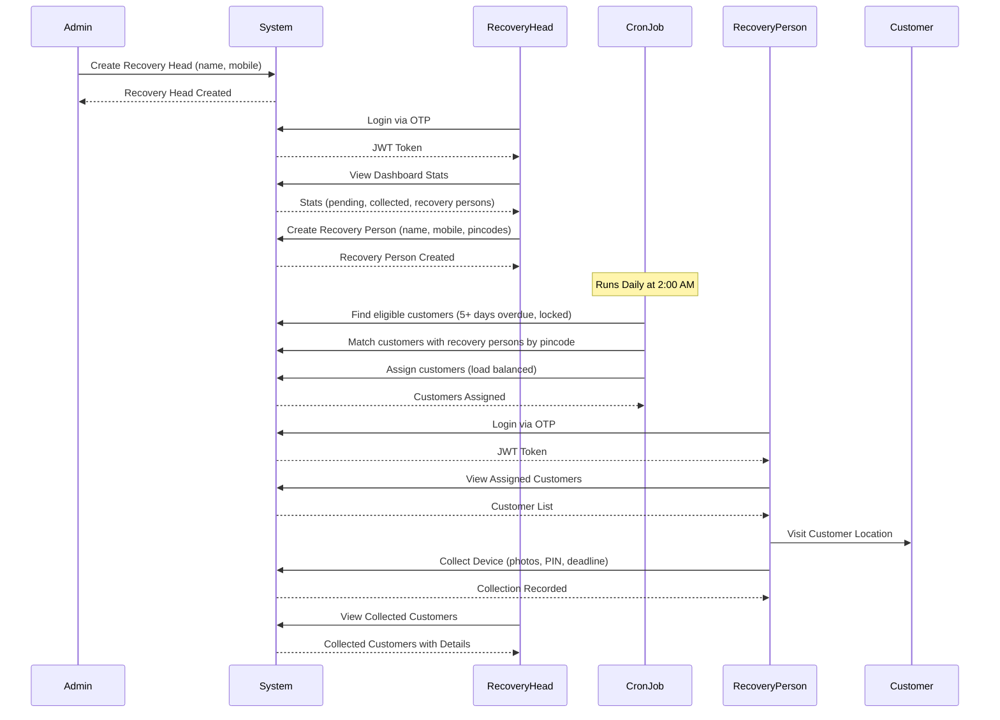

# Recovery Flow System - Complete Guide

## Table of Contents

1. [System Overview](#system-overview)
2. [Complete Flow Diagram](#complete-flow-diagram)
3. [Actors and Roles](#actors-and-roles)
4. [Detailed Flow Steps](#detailed-flow-steps)
5. [API Endpoints Summary](#api-endpoints-summary)
6. [Data Models](#data-models)
7. [Business Rules](#business-rules)
8. [Automated Processes](#automated-processes)

---

## System Overview

The Recovery Flow System is designed to manage the collection of devices from customers who have overdue EMI payments. The system involves three main actors: **Admin**, **Recovery Head**, and **Recovery Person**.

### Key Features

- ✅ **Automated Customer Assignment**: Customers are automatically assigned to recovery persons based on pincode matching and EMI overdue status
- ✅ **Load Balancing**: Customers are distributed evenly among recovery persons with matching pincodes
- ✅ **Real-time Statistics**: Recovery heads can view pending and completed collections
- ✅ **Device Collection Tracking**: Complete tracking of collected devices with images, PIN, and payment deadlines
- ✅ **OTP-based Authentication**: Secure login for recovery heads and recovery persons

---

## Complete Flow Diagram



---

## Actors and Roles

### 1. Admin
**Responsibilities**:
- Create recovery heads
- Manage recovery heads (activate/deactivate)
- View all recovery heads and their statistics
- Monitor system-wide recovery operations

**Access Level**: Full system access

---

### 2. Recovery Head
**Responsibilities**:
- Login via mobile OTP
- View dashboard statistics (pending/completed collections, recovery persons count)
- Create recovery persons with pincode assignments
- View all recovery persons and their assigned customers
- View pending collections
- View completed collections with device details
- Manage recovery persons (activate/deactivate)

**Access Level**: Own recovery persons and their assigned customers

---

### 3. Recovery Person
**Responsibilities**:
- Login via mobile OTP
- View assigned customers
- Visit customer locations
- Collect devices from customers
- Record collection details (photos, PIN, payment deadline, notes)
- View dashboard statistics (assigned customers, completed collections)

**Access Level**: Only assigned customers

---

## Detailed Flow Steps

### Step 1: Admin Creates Recovery Head

**Actor**: Admin

**API**: `POST /api/admin/recovery-heads`

**Request**:
```json
{
  "fullName": "Rajesh Kumar",
  "mobileNumber": "9876543210"
}
```

**Response**:
```json
{
  "success": true,
  "message": "Recovery head created successfully",
  "data": {
    "recoveryHeadId": "507f1f77bcf86cd799439011",
    "fullName": "Rajesh Kumar",
    "mobileNumber": "9876543210",
    "status": "ACTIVE",
    "createdAt": "2025-12-28T10:00:00.000Z"
  }
}
```

**Business Rules**:
- Mobile number must be unique
- Mobile number must be exactly 10 digits
- Full name is required
- Status defaults to ACTIVE

---

### Step 2: Recovery Head Login

**Actor**: Recovery Head

**APIs**: 
1. `POST /api/recovery-head/send-otp`
2. `POST /api/recovery-head/verify-otp`

**Flow**:

#### 2.1 Send OTP
```json
// Request
{
  "mobileNumber": "9876543210"
}

// Response
{
  "success": true,
  "message": "OTP sent successfully to 9876543210",
  "data": {
    "mobileNumber": "9876543210",
    "otpSentAt": "2025-12-28T10:05:00.000Z"
  }
}
```

#### 2.2 Verify OTP
```json
// Request
{
  "mobileNumber": "9876543210",
  "otp": "123456"
}

// Response
{
  "success": true,
  "message": "Login successful",
  "data": {
    "token": "eyJhbGciOiJIUzI1NiIsInR5cCI6IkpXVCJ9...",
    "recoveryHead": {
      "recoveryHeadId": "507f1f77bcf86cd799439011",
      "fullName": "Rajesh Kumar",
      "mobileNumber": "9876543210",
      "status": "ACTIVE"
    }
  }
}
```

**Business Rules**:
- OTP valid for 10 minutes
- Maximum 3 OTP attempts
- Recovery head must exist and be ACTIVE

---

### Step 3: Recovery Head Views Dashboard

**Actor**: Recovery Head

**API**: `GET /api/recovery-head/statistics`

**Request**:
```
GET /api/recovery-head/statistics
Authorization: Bearer <token>
```

**Response**:
```json
{
  "success": true,
  "message": "Statistics fetched successfully",
  "data": {
    "totalRecoveryPersons": 5,
    "totalCustomersAssigned": 45,
    "pendingCollections": 28,
    "completedCollections": 17,
    "collectionRate": 37.78,
    "breakdown": {
      "overdueBy5to10Days": 12,
      "overdueBy10to20Days": 10,
      "overdueByMoreThan20Days": 6
    }
  }
}
```

**Metrics Explained**:
- `totalRecoveryPersons`: Active recovery persons under this recovery head
- `totalCustomersAssigned`: Total customers assigned to all recovery persons
- `pendingCollections`: Customers where `isCollected = false`
- `completedCollections`: Customers where `isCollected = true`
- `collectionRate`: (completedCollections / totalCustomersAssigned) × 100
- `breakdown`: Customers grouped by days overdue

---

### Step 4: Recovery Head Creates Recovery Person

**Actor**: Recovery Head

**API**: `POST /api/recovery-head/recovery-persons`

**Request**:
```json
{
  "fullName": "Amit Singh",
  "mobileNumber": "9988776655",
  "pinCodes": ["221001", "221002", "221005"]
}
```

**Response**:
```json
{
  "success": true,
  "message": "Recovery person created successfully",
  "data": {
    "recoveryPersonId": "507f1f77bcf86cd799439022",
    "fullName": "Amit Singh",
    "mobileNumber": "9988776655",
    "pinCodes": ["221001", "221002", "221005"],
    "isActive": true,
    "recoveryHeadId": "507f1f77bcf86cd799439011",
    "recoveryHeadName": "Rajesh Kumar",
    "assignedCustomersCount": 0,
    "createdAt": "2025-12-28T11:00:00.000Z"
  }
}
```

**Business Rules**:
- Mobile number must be unique globally
- Mobile number must be exactly 10 digits
- At least one pincode required
- Each pincode must be exactly 6 digits
- Recovery person is linked to authenticated recovery head
- Status defaults to ACTIVE

---

### Step 5: Automated Customer Assignment (Cron Job)

**Actor**: System (Automated)

**Trigger**: Daily at 2:00 AM

**Process**:

#### 5.1 Find Eligible Customers
```javascript
Criteria:
- isLocked = true
- isCollected = false
- Has at least one EMI overdue by 5+ days
- NOT already assigned to any recovery person
```

#### 5.2 Match with Recovery Persons
```javascript
For each eligible customer:
1. Get customer's pincode (e.g., "221001")
2. Find all active recovery persons with matching pincode
3. If multiple recovery persons found:
   - Select the one with least assigned customers (load balancing)
4. Assign customer to selected recovery person
```

#### 5.3 Create Assignment
```javascript
1. Add customer ID to recoveryPerson.customers array
2. Create RecoveryHeadAssignment record:
   - recoveryHeadId: recovery person's recovery head
   - recoveryPersonId: selected recovery person
   - customerId: customer being assigned
   - status: 'ACTIVE'
   - assignedAt: current timestamp
```

**Example Assignment**:
```
Customer: Suresh Yadav (pincode: 221001, 8 days overdue, locked)
↓
Matching Recovery Persons:
- Amit Singh (pincode: 221001, 10 customers assigned)
- Vikram Sharma (pincode: 221001, 15 customers assigned)
↓
Selected: Amit Singh (least customers)
↓
Assignment Created
```

**Logging**:
```
[2025-12-28 02:00:15] Auto-Assignment Started
[2025-12-28 02:00:16] Found 23 eligible customers
[2025-12-28 02:00:17] Assigned customer Suresh Yadav to Amit Singh
[2025-12-28 02:00:18] Assigned customer Ramesh Gupta to Vikram Sharma
...
[2025-12-28 02:00:45] Auto-Assignment Completed: 23 customers assigned
```

---

### Step 6: Recovery Person Login

**Actor**: Recovery Person

**APIs**:
1. `POST /api/recovery-person/auth/send-otp`
2. `POST /api/recovery-person/auth/verify-otp`

**Flow**: Same as Recovery Head login (Step 2)

---

### Step 7: Recovery Person Views Assigned Customers

**Actor**: Recovery Person

**API**: `GET /api/recovery-person/customers`

**Request**:
```
GET /api/recovery-person/customers?page=1&limit=20
Authorization: Bearer <recovery_person_token>
```

**Response**:
```json
{
  "success": true,
  "message": "Assigned customers fetched successfully",
  "data": {
    "customers": [
      {
        "customerId": "507f1f77bcf86cd799439033",
        "fullName": "Suresh Yadav",
        "mobileNumber": "9123456789",
        "address": {
          "village": "Rampur",
          "nearbyLocation": "Near Temple",
          "pincode": "221001",
          "district": "Varanasi"
        },
        "deviceInfo": {
          "model": "Samsung Galaxy A54",
          "imei1": "123456789012345",
          "isLocked": true
        },
        "emiDetails": {
          "balanceAmount": 15000,
          "emiPerMonth": 2500,
          "nextDueDate": "2025-12-15T00:00:00.000Z",
          "daysSinceDue": 8,
          "overdueAmount": 5000
        },
        "isCollected": false,
        "assignedAt": "2025-12-28T02:00:17.000Z"
      }
    ],
    "pagination": {
      "currentPage": 1,
      "totalPages": 2,
      "totalItems": 15,
      "itemsPerPage": 20
    }
  }
}
```

---

### Step 8: Recovery Person Collects Device

**Actor**: Recovery Person

**API**: `POST /api/recovery-person/collect-device`

**Request** (multipart/form-data):
```
customerId: 507f1f77bcf86cd799439033
deviceFrontImage: [File]
deviceBackImage: [File]
devicePin: 1234
paymentDeadline: 2025-12-31T23:59:59.000Z
notes: Customer agreed to pay by deadline or device will be sold
```

**Response**:
```json
{
  "success": true,
  "message": "Device collected successfully",
  "data": {
    "customerId": "507f1f77bcf86cd799439033",
    "customerName": "Suresh Yadav",
    "isCollected": true,
    "collectedAt": "2025-12-28T14:30:00.000Z",
    "deviceCollection": {
      "deviceFrontImage": "https://res.cloudinary.com/xxx/device_front.jpg",
      "deviceBackImage": "https://res.cloudinary.com/xxx/device_back.jpg",
      "devicePin": "1234",
      "paymentDeadline": "2025-12-31T23:59:59.000Z",
      "collectedBy": "507f1f77bcf86cd799439022",
      "collectedByName": "Amit Singh",
      "notes": "Customer agreed to pay by deadline or device will be sold"
    }
  }
}
```

**Business Rules**:
- Customer must be assigned to authenticated recovery person
- Device must not be already collected
- Both front and back images required
- Device PIN required
- Payment deadline required (future date)
- Images uploaded to Cloudinary server-side
- Customer's `isCollected` flag set to `true`
- `collectedAt` timestamp recorded

---

### Step 9: Recovery Head Views Pending Collections

**Actor**: Recovery Head

**API**: `GET /api/recovery-head/pending-collections`

**Request**:
```
GET /api/recovery-head/pending-collections?page=1&limit=10&search=Suresh
Authorization: Bearer <recovery_head_token>
```

**Response**:
```json
{
  "success": true,
  "message": "Pending collections fetched successfully",
  "data": {
    "customers": [
      {
        "customerId": "507f1f77bcf86cd799439034",
        "fullName": "Suresh Kumar",
        "mobileNumber": "9234567890",
        "pincode": "221002",
        "deviceInfo": {
          "model": "Redmi Note 12",
          "imei1": "543210987654321",
          "isLocked": true
        },
        "emiDetails": {
          "balanceAmount": 12000,
          "emiPerMonth": 2000,
          "overdueAmount": 4000,
          "daysSinceDue": 10
        },
        "assignedTo": {
          "recoveryPersonId": "507f1f77bcf86cd799439022",
          "recoveryPersonName": "Amit Singh",
          "recoveryPersonMobile": "9988776655"
        },
        "assignedAt": "2025-12-28T02:00:18.000Z"
      }
    ],
    "pagination": {
      "currentPage": 1,
      "totalPages": 3,
      "totalItems": 28,
      "itemsPerPage": 10
    }
  }
}
```

**Features**:
- Pagination support
- Search by customer name, mobile, IMEI
- Shows which recovery person is assigned
- Shows days since due and overdue amount
- Sorted by days since due (most overdue first)

---

### Step 10: Recovery Head Views Collected Customers

**Actor**: Recovery Head

**API**: `GET /api/recovery-head/collected-customers`

**Request**:
```
GET /api/recovery-head/collected-customers?page=1&limit=10
Authorization: Bearer <recovery_head_token>
```

**Response**: See [RECOVERY_HEAD_COLLECTED_CUSTOMERS_API.md](file:///c:/flutter_extra_project/lock_system_backend/Emi-backend/api_docs/RECOVERY_HEAD_COLLECTED_CUSTOMERS_API.md) for complete response structure.

**Key Information Returned**:
- Complete customer details (personal info, address, documents)
- Device information (IMEI, model, lock status)
- EMI details (balance, payments, next due)
- Collection details (images, PIN, payment deadline, notes)
- Recovery person who collected the device
- Retailer information

---

## API Endpoints Summary

### Admin APIs

| Method | Endpoint | Description | Auth |
|--------|----------|-------------|------|
| POST | `/api/admin/recovery-heads` | Create recovery head | Admin |
| GET | `/api/admin/recovery-heads` | Get all recovery heads | Admin |
| PUT | `/api/admin/recovery-heads/:id/status` | Update recovery head status | Admin |

---

### Recovery Head Authentication APIs

| Method | Endpoint | Description | Auth |
|--------|----------|-------------|------|
| POST | `/api/recovery-head/send-otp` | Send OTP to mobile | Public |
| POST | `/api/recovery-head/verify-otp` | Verify OTP and login | Public |

---

### Recovery Head Dashboard APIs

| Method | Endpoint | Description | Auth |
|--------|----------|-------------|------|
| GET | `/api/recovery-head/statistics` | Get dashboard statistics | Recovery Head |
| GET | `/api/recovery-head/pending-collections` | Get pending collections | Recovery Head |
| GET | `/api/recovery-head/collected-customers` | Get collected customers | Recovery Head |

---

### Recovery Person Management APIs

| Method | Endpoint | Description | Auth |
|--------|----------|-------------|------|
| POST | `/api/recovery-head/recovery-persons` | Create recovery person | Recovery Head |
| GET | `/api/recovery-head/recovery-persons` | Get all recovery persons | Recovery Head |
| PUT | `/api/recovery-head/recovery-persons/:id/status` | Update recovery person status | Recovery Head |
| GET | `/api/recovery-head/recovery-persons-with-customers` | Get recovery persons with customers | Recovery Head |

---

### Recovery Person APIs

| Method | Endpoint | Description | Auth |
|--------|----------|-------------|------|
| POST | `/api/recovery-person/auth/send-otp` | Send OTP to mobile | Public |
| POST | `/api/recovery-person/auth/verify-otp` | Verify OTP and login | Public |
| GET | `/api/recovery-person/customers` | Get assigned customers | Recovery Person |
| GET | `/api/recovery-person/statistics` | Get dashboard statistics | Recovery Person |
| POST | `/api/recovery-person/collect-device` | Collect device from customer | Recovery Person |
| GET | `/api/recovery-person/customers/:id` | Get customer details | Recovery Person |
| GET | `/api/recovery-person/customers/:id/location` | Get customer location | Recovery Person |

---

## Data Models

### RecoveryHead Model

```javascript
{
  _id: ObjectId,
  fullName: String (required),
  mobileNumber: String (required, unique, 10 digits),
  status: String (enum: ['ACTIVE', 'INACTIVE'], default: 'ACTIVE'),
  createdAt: Date,
  updatedAt: Date
}
```

**Indexes**:
- `mobileNumber` (unique)
- `status`
- Text index on `fullName`, `mobileNumber`

---

### RecoveryPerson Model

```javascript
{
  _id: ObjectId,
  fullName: String (required),
  mobileNumber: String (required, unique, 10 digits),
  pinCodes: [String] (required, array of 6-digit pincodes, min 1),
  mobileVerified: Boolean (default: false),
  isActive: Boolean (default: true),
  recoveryHeadId: ObjectId (ref: 'RecoveryHead', required),
  customers: [ObjectId] (ref: 'Customer'),
  createdAt: Date,
  updatedAt: Date
}
```

**Indexes**:
- `mobileNumber` (unique)
- `recoveryHeadId`
- `isActive`
- `pinCodes`
- `customers`

---

### Customer Model (Relevant Fields)

```javascript
{
  _id: ObjectId,
  fullName: String,
  mobileNumber: String,
  address: {
    pincode: String (6 digits)
  },
  emiDetails: {
    emiMonths: [{
      month: Number,
      dueDate: Date,
      paid: Boolean,
      amount: Number
    }],
    balanceAmount: Number
  },
  isLocked: Boolean,
  isCollected: Boolean,
  collectedAt: Date,
  deviceCollection: {
    deviceFrontImage: String (Cloudinary URL),
    deviceBackImage: String (Cloudinary URL),
    devicePin: String,
    paymentDeadline: Date,
    collectedBy: ObjectId (ref: 'RecoveryPerson'),
    collectedByName: String,
    notes: String
  }
}
```

---

### RecoveryHeadAssignment Model

```javascript
{
  _id: ObjectId,
  recoveryHeadId: ObjectId (ref: 'RecoveryHead', required),
  recoveryHeadName: String,
  recoveryPersonId: ObjectId (ref: 'RecoveryPerson', required),
  recoveryPersonName: String,
  customerId: ObjectId (ref: 'Customer', required),
  customerName: String,
  status: String (enum: ['ACTIVE', 'INACTIVE'], default: 'ACTIVE'),
  assignedAt: Date,
  unassignedAt: Date,
  createdAt: Date,
  updatedAt: Date
}
```

**Indexes**:
- `recoveryHeadId`
- `recoveryPersonId`
- `customerId`
- `status`

---

## Business Rules

### Customer Eligibility for Assignment

A customer is eligible for assignment if ALL of the following are true:

1. ✅ **Device is locked**: `isLocked = true`
2. ✅ **Device not collected**: `isCollected = false`
3. ✅ **EMI overdue by 5+ days**: At least one EMI in `emiDetails.emiMonths` where:
   - `paid = false`
   - `dueDate <= (current date - 5 days)`
4. ✅ **Not already assigned**: Customer ID not in any ACTIVE `RecoveryHeadAssignment`

---

### Recovery Person Selection (Load Balancing)

When multiple recovery persons have matching pincodes:

1. Get all active recovery persons with matching pincode
2. Count assigned customers for each recovery person
3. Select the recovery person with the **least number of assigned customers**
4. If tie, select the one created earliest

**Example**:
```
Customer pincode: 221001

Recovery Persons with pincode 221001:
- Amit Singh: 10 customers
- Vikram Sharma: 15 customers
- Priya Patel: 10 customers (created later)

Selected: Amit Singh (least customers, created earlier)
```

---

### Collection Rules

1. **One-time collection**: Device can only be collected once
2. **Assignment verification**: Customer must be assigned to the recovery person
3. **Required fields**: Front image, back image, device PIN, payment deadline
4. **Image upload**: Images uploaded to Cloudinary server-side
5. **Automatic status update**: `isCollected` set to `true`, `collectedAt` timestamp recorded

---

### Payment Deadline Rules

1. Must be a future date
2. Typically set 15-30 days from collection date
3. After deadline expires, device can be sold
4. Recovery head can view all devices with expired deadlines

---

## Automated Processes

### 1. Auto-Assignment Cron Job

**Schedule**: Daily at 2:00 AM

**File**: `src/jobs/autoAssignCustomersToRecoveryPersons.js`

**Process**:
1. Find eligible customers (5+ days overdue, locked, not collected, not assigned)
2. For each customer, find recovery persons with matching pincode
3. Select recovery person with least customers (load balancing)
4. Create assignment
5. Log results

**Monitoring**:
- Log file: `logs/auto-assignment.log`
- Metrics: Total eligible customers, total assigned, total skipped (no matching pincode)

---

### 2. OTP Cleanup Job

**Schedule**: Every hour

**Process**:
- Delete expired OTPs (older than 10 minutes)
- Clean up OTP attempts table

---

### 3. Statistics Cache Update

**Schedule**: Every 15 minutes

**Process**:
- Pre-calculate statistics for all recovery heads
- Cache results in Redis
- Improves dashboard load time

---

## Error Handling

### Common Error Codes

| Code | Description | HTTP Status |
|------|-------------|-------------|
| `UNAUTHORIZED` | Invalid or missing token | 401 |
| `TOKEN_EXPIRED` | JWT token expired | 401 |
| `VALIDATION_ERROR` | Request validation failed | 400 |
| `NOT_FOUND` | Resource not found | 404 |
| `ALREADY_EXISTS` | Resource already exists (e.g., duplicate mobile) | 409 |
| `ALREADY_COLLECTED` | Device already collected | 409 |
| `SERVER_ERROR` | Internal server error | 500 |

---

## Security Considerations

### 1. Authentication
- ✅ OTP-based login (no passwords)
- ✅ JWT tokens with expiration
- ✅ Token refresh mechanism

### 2. Authorization
- ✅ Role-based access control (Admin, Recovery Head, Recovery Person)
- ✅ Recovery heads can only access their own recovery persons
- ✅ Recovery persons can only access their assigned customers

### 3. Data Privacy
- ✅ Customer data only accessible to assigned recovery person and their recovery head
- ✅ Cloudinary images with secure URLs
- ✅ Sensitive data (device PIN) encrypted at rest

### 4. Rate Limiting
- ✅ OTP requests limited to 3 per 10 minutes per mobile number
- ✅ API rate limiting: 100 requests per minute per user

---

## Performance Optimization

### 1. Database Indexes
- All foreign keys indexed
- Frequently queried fields indexed
- Compound indexes for common queries

### 2. Caching
- Statistics cached in Redis
- Recovery person list cached per recovery head
- Customer list cached per recovery person

### 3. Pagination
- All list APIs support pagination
- Default limit: 20 items
- Maximum limit: 100 items

---

## Monitoring and Logging

### 1. Application Logs
- Request/response logging
- Error logging with stack traces
- Performance metrics (response times)

### 2. Business Metrics
- Daily assignment count
- Collection rate per recovery person
- Average days to collection
- Customer distribution by pincode

### 3. Alerts
- Failed cron jobs
- High error rates
- Slow API responses (>2 seconds)

---

## Support and Troubleshooting

### Common Issues

**Issue**: Customer not assigned despite being eligible

**Solution**:
1. Check if customer's pincode matches any recovery person's pincodes
2. Verify customer is locked and has overdue EMI
3. Check cron job logs for errors

---

**Issue**: Recovery person not receiving customers

**Solution**:
1. Verify recovery person is ACTIVE
2. Check assigned pincodes are correct
3. Verify there are eligible customers in those pincodes

---

**Issue**: Collection failing with image upload error

**Solution**:
1. Check Cloudinary configuration
2. Verify image file size (max 5MB)
3. Check image format (JPEG, PNG supported)

---

## Appendix

### A. Sample Data

#### Sample Recovery Head
```json
{
  "fullName": "Rajesh Kumar",
  "mobileNumber": "9876543210",
  "status": "ACTIVE"
}
```

#### Sample Recovery Person
```json
{
  "fullName": "Amit Singh",
  "mobileNumber": "9988776655",
  "pinCodes": ["221001", "221002", "221005"],
  "recoveryHeadId": "507f1f77bcf86cd799439011"
}
```

#### Sample Customer (Eligible for Assignment)
```json
{
  "fullName": "Suresh Yadav",
  "mobileNumber": "9123456789",
  "address": { "pincode": "221001" },
  "isLocked": true,
  "isCollected": false,
  "emiDetails": {
    "emiMonths": [
      {
        "month": 5,
        "dueDate": "2025-12-15T00:00:00.000Z",
        "paid": false,
        "amount": 2500
      }
    ]
  }
}
```

---

### B. Glossary

| Term | Definition |
|------|------------|
| **Recovery Head** | Manager who oversees recovery persons and monitors collections |
| **Recovery Person** | Field agent who visits customers and collects devices |
| **EMI** | Equated Monthly Installment - monthly payment for device |
| **Overdue** | EMI payment past its due date |
| **Collection** | Process of physically collecting device from customer |
| **Pincode** | 6-digit postal code used for geographic assignment |
| **Load Balancing** | Distributing customers evenly among recovery persons |
| **Cron Job** | Scheduled automated task that runs at specific times |

---

### C. Related Documentation

- [Device Collection API Documentation](file:///c:/flutter_extra_project/lock_system_backend/Emi-backend/api_docs/DEVICE_COLLECTION_API_DOCUMENTATION.md)
- [Recovery Head Collected Customers API](file:///c:/flutter_extra_project/lock_system_backend/Emi-backend/api_docs/RECOVERY_HEAD_COLLECTED_CUSTOMERS_API.md)
- [Recovery Person Authentication API](file:///c:/flutter_extra_project/lock_system_backend/Emi-backend/api_docs/recovery_person_auth_api.md)

---

**Document Version**: 1.0  
**Last Updated**: 2025-12-28  
**Author**: Development Team
