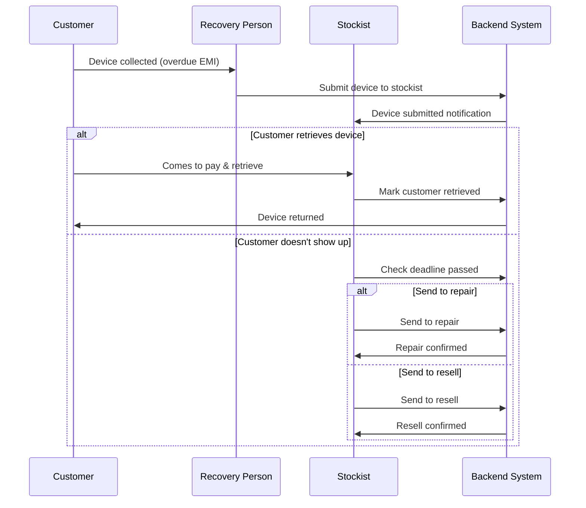

# Stockist Management System - Complete API Documentation

## Table of Contents

1. [Overview](#overview)
2. [System Architecture](#system-architecture)
3. [Data Models](#data-models)
4. [Recovery Person APIs](#recovery-person-apis)
5. [Stockist Authentication APIs](#stockist-authentication-apis)
6. [Stockist Management APIs](#stockist-management-apis)
7. [Business Rules](#business-rules)
8. [Error Handling](#error-handling)
9. [Usage Examples](#usage-examples)

---

## Overview

The Stockist Management System extends the recovery workflow by adding a stockist layer. After recovery persons collect devices from customers, they can submit these devices to a stockist. The stockist then manages three possible outcomes:

1. **Customer Retrieval**: Customer comes to stockist, pays pending amount, and retrieves device
2. **Send to Repair**: Customer doesn't show up by deadline, device sent for repair
3. **Send to Resell**: Customer doesn't show up by deadline, device sent to resell market

---

## System Architecture



---

## Data Models

### 1. Stockist Model

**Collection**: `stockists`

```javascript
{
  _id: ObjectId,
  fullName: String,              // Required, trimmed
  mobileNumber: String,          // Required, unique, 10 digits
  shopName: String,              // Required, trimmed
  address: {
    street: String,              // Required
    city: String,                // Required
    state: String,               // Required
    pincode: String              // Required, 6 digits
  },
  pinCodes: [String],            // Service area pincodes (6 digits each)
  isActive: Boolean,             // Default: true
  mobileVerified: Boolean,       // Default: false
  createdAt: Date,
  updatedAt: Date
}
```

**Indexes**:
- `mobileNumber`: Unique index
- `isActive`: For active stockist queries
- `pinCodes`: For location-based queries

---

### 2. DeviceSubmission Model

**Collection**: `devicesubmissions`

```javascript
{
  _id: ObjectId,
  customerId: ObjectId,          // Ref: Customer
  recoveryPersonId: ObjectId,    // Ref: RecoveryPerson
  stockistId: ObjectId,          // Ref: Stockist
  
  submittedAt: Date,             // Submission timestamp
  paymentDeadline: Date,         // Deadline for customer retrieval
  
  status: String,                // Enum: PENDING, RETURNED_TO_CUSTOMER, 
                                 //       SENT_TO_REPAIR, SENT_TO_RESELL
  
  // Customer retrieval details
  customerRetrievalInfo: {
    retrievedAt: Date,
    amountPaid: Number,
    paymentMethod: String,       // Enum: CASH, UPI, CARD
    notes: String
  },
  
  // Repair details
  repairInfo: {
    sentToRepairAt: Date,
    estimatedCost: Number,
    repairVendor: String,
    repairNotes: String
  },
  
  // Resell details
  resellInfo: {
    sentToResellAt: Date,
    estimatedValue: Number,
    resellPlatform: String,
    resellNotes: String
  },
  
  actionTakenAt: Date,           // When final action was taken
  actionTakenBy: ObjectId,       // Ref: Stockist
  
  createdAt: Date,
  updatedAt: Date
}
```

**Indexes**:
- `customerId`: For customer lookup
- `stockistId`: For stockist queries
- `status`: For filtering by status
- `paymentDeadline`: For deadline queries
- Compound: `stockistId + status` for efficient dashboard queries

---

### 3. Customer Model Updates

**New Fields Added**:

```javascript
{
  // ... existing fields ...
  
  submittedToStockist: Boolean,  // Default: false
  submittedAt: Date,             // Null if not submitted
  stockistId: ObjectId,          // Ref: Stockist, null if not submitted
  
  // ... existing fields ...
}
```

**New Index**:
- `submittedToStockist`: For filtering submitted devices

---

## Recovery Person APIs

### 1. Submit Device to Stockist

**Endpoint**: `POST /api/recovery-person/submit-to-stockist`

**Authentication**: Required (Recovery Person JWT)

**Description**: Submit a collected device to the stockist for further processing. The system automatically submits to the single active stockist in the system.

#### Request

**Headers**:
```
Authorization: Bearer <recovery-person-jwt-token>
Content-Type: application/json
```

**Body**:
```json
{
  "customerId": "6952d1151709de3521e201cb",
  "notes": "Device in good condition, customer promised to come within 5 days"
}
```

**Field Validations**:
- `customerId`: Required, valid ObjectId
- `notes`: Optional, max 500 characters

> [!NOTE]
> The `stockistId` is not required. The system automatically finds and uses the single active stockist in the system.

#### Response

**Success (200 OK)**:
```json
{
  "success": true,
  "message": "Device submitted to stockist successfully",
  "data": {
    "submissionId": "6952d1151709de3521e201cd",
    "customerId": "6952d1151709de3521e201cb",
    "customerName": "Ravi Tiwari",
    "deviceInfo": {
      "productName": "Samsung Galaxy A14",
      "imei1": "123456789012345"
    },
    "stockist": {
      "stockistId": "6952d1151709de3521e201cc",
      "shopName": "Mobile Point",
      "mobileNumber": "9876543210"
    },
    "submittedAt": "2026-01-11T15:30:00.000Z",
    "paymentDeadline": "2026-01-16T00:00:00.000Z"
  }
}
```

**Error Responses**:

*Device Not Collected (400)*:
```json
{
  "success": false,
  "message": "Device has not been collected yet",
  "error": "DEVICE_NOT_COLLECTED"
}
```

*Already Submitted (400)*:
```json
{
  "success": false,
  "message": "Device has already been submitted to stockist",
  "error": "ALREADY_SUBMITTED"
}
```

*Stockist Not Found (404)*:
```json
{
  "success": false,
  "message": "No active stockist found in the system",
  "error": "STOCKIST_NOT_FOUND"
}
```

*Not Assigned (403)*:
```json
{
  "success": false,
  "message": "This customer is not assigned to you",
  "error": "NOT_AUTHORIZED"
}
```

---

### 2. Get Dashboard Stats (Updated)

**Endpoint**: `GET /api/recovery-person/dashboard`

**Authentication**: Required (Recovery Person JWT)

**Description**: Get updated dashboard statistics including submitted devices count.

#### Request

**Headers**:
```
Authorization: Bearer <recovery-person-jwt-token>
```

#### Response

**Success (200 OK)**:
```json
{
  "success": true,
  "message": "Dashboard statistics fetched successfully",
  "data": {
    "totalAssigned": 15,
    "totalCollected": 8,
    "totalReturned": 3,
    "totalSubmittedToStockist": 5
  }
}
```

**Field Descriptions**:
- `totalAssigned`: Customers currently assigned
- `totalCollected`: Devices collected from customers
- `totalReturned`: Devices returned (customer paid and took device)
- `totalSubmittedToStockist`: Devices submitted to stockist (NEW)

---

## Stockist Authentication APIs

### 1. Send OTP

**Endpoint**: `POST /api/stockist/send-otp`

**Authentication**: None

**Description**: Send OTP to stockist's mobile number for login.

#### Request

**Headers**:
```
Content-Type: application/json
```

**Body**:
```json
{
  "mobileNumber": "9876543210"
}
```

**Validations**:
- `mobileNumber`: Required, exactly 10 digits

#### Response

**Success (200 OK)**:
```json
{
  "success": true,
  "message": "OTP sent successfully to 9876543210",
  "data": {
    "mobileNumber": "9876543210",
    "expiresIn": 300
  }
}
```

**Error Responses**:

*Stockist Not Found (404)*:
```json
{
  "success": false,
  "message": "Stockist not found with this mobile number",
  "error": "STOCKIST_NOT_FOUND"
}
```

*Inactive Account (403)*:
```json
{
  "success": false,
  "message": "Stockist account is inactive",
  "error": "ACCOUNT_INACTIVE"
}
```

---

### 2. Verify OTP

**Endpoint**: `POST /api/stockist/verify-otp`

**Authentication**: None

**Description**: Verify OTP and generate JWT token for stockist.

#### Request

**Headers**:
```
Content-Type: application/json
```

**Body**:
```json
{
  "mobileNumber": "9876543210",
  "otp": "123456"
}
```

**Validations**:
- `mobileNumber`: Required, exactly 10 digits
- `otp`: Required, exactly 6 digits

#### Response

**Success (200 OK)**:
```json
{
  "success": true,
  "message": "OTP verified successfully",
  "data": {
    "token": "eyJhbGciOiJIUzI1NiIsInR5cCI6IkpXVCJ9...",
    "stockist": {
      "stockistId": "6952d1151709de3521e201cc",
      "fullName": "Rajesh Kumar",
      "shopName": "Mobile Point",
      "mobileNumber": "9876543210",
      "address": {
        "street": "Main Market",
        "city": "Varanasi",
        "state": "Uttar Pradesh",
        "pincode": "221001"
      }
    }
  }
}
```

**Error Responses**:

*Invalid OTP (400)*:
```json
{
  "success": false,
  "message": "Invalid or expired OTP",
  "error": "INVALID_OTP"
}
```

---

## Stockist Management APIs

### 1. Get Dashboard Statistics

**Endpoint**: `GET /api/stockist/dashboard`

**Authentication**: Required (Stockist JWT)

**Description**: Get comprehensive dashboard statistics for the stockist.

#### Request

**Headers**:
```
Authorization: Bearer <stockist-jwt-token>
```

#### Response

**Success (200 OK)**:
```json
{
  "success": true,
  "message": "Dashboard statistics fetched successfully",
  "data": {
    "totalDevicesReceived": 25,
    "pendingAction": 12,
    "returnedToCustomer": 8,
    "sentToRepair": 3,
    "sentToResell": 2,
    "overdueDevices": 5,
    "todaySubmissions": 3
  }
}
```

**Field Descriptions**:
- `totalDevicesReceived`: Total devices ever received
- `pendingAction`: Devices awaiting action (status: PENDING)
- `returnedToCustomer`: Devices returned to customers
- `sentToRepair`: Devices sent for repair
- `sentToResell`: Devices sent for resell
- `overdueDevices`: Pending devices past payment deadline
- `todaySubmissions`: Devices received today

---

### 2. Get Submitted Devices

**Endpoint**: `GET /api/stockist/submitted-devices`

**Authentication**: Required (Stockist JWT)

**Description**: Get list of devices submitted to this stockist with filtering and pagination.

#### Request

**Headers**:
```
Authorization: Bearer <stockist-jwt-token>
```

**Query Parameters**:
| Parameter | Type | Required | Default | Description |
|-----------|------|----------|---------|-------------|
| status | string | No | all | Filter by status: PENDING, RETURNED_TO_CUSTOMER, SENT_TO_REPAIR, SENT_TO_RESELL, all |
| page | integer | No | 1 | Page number |
| limit | integer | No | 20 | Items per page (max: 100) |
| sortBy | string | No | submittedAt | Sort field: submittedAt, paymentDeadline |
| sortOrder | string | No | desc | Sort order: asc, desc |

**Example Request**:
```
GET /api/stockist/submitted-devices?status=PENDING&page=1&limit=10&sortBy=paymentDeadline&sortOrder=asc
```

#### Response

**Success (200 OK)**:
```json
{
  "success": true,
  "message": "Submitted devices fetched successfully",
  "data": {
    "devices": [
      {
        "submissionId": "6952d1151709de3521e201cd",
        "status": "PENDING",
        "submittedAt": "2026-01-11T15:30:00.000Z",
        "paymentDeadline": "2026-01-16T00:00:00.000Z",
        "isOverdue": false,
        "daysUntilDeadline": 5,
        "customer": {
          "customerId": "6952d1151709de3521e201cb",
          "fullName": "Ravi Tiwari",
          "mobileNumber": "9876543210",
          "address": {
            "village": "Rampur",
            "district": "Varanasi",
            "pincode": "221001"
          }
        },
        "device": {
          "productName": "Samsung Galaxy A14",
          "model": "SM-A145F",
          "imei1": "123456789012345",
          "phoneType": "ANDROID"
        },
        "emiDetails": {
          "balanceAmount": 5000,
          "sellPrice": 15000,
          "downPaymentPending": 0
        },
        "recoveryPerson": {
          "fullName": "Amit Singh",
          "mobileNumber": "9988776655"
        },
        "collectionInfo": {
          "deviceFrontImage": "https://cloudinary.com/device-front.jpg",
          "deviceBackImage": "https://cloudinary.com/device-back.jpg",
          "devicePin": "1234",
          "notes": "Device in good condition"
        }
      }
    ],
    "pagination": {
      "currentPage": 1,
      "totalPages": 2,
      "totalItems": 12,
      "itemsPerPage": 10,
      "hasNextPage": true,
      "hasPrevPage": false
    }
  }
}
```

---

### 3. Get Device Details

**Endpoint**: `GET /api/stockist/device/:submissionId`

**Authentication**: Required (Stockist JWT)

**Description**: Get complete details of a specific device submission.

#### Request

**Headers**:
```
Authorization: Bearer <stockist-jwt-token>
```

**Path Parameters**:
- `submissionId`: DeviceSubmission ID

**Example Request**:
```
GET /api/stockist/device/6952d1151709de3521e201cd
```

#### Response

**Success (200 OK)**:
```json
{
  "success": true,
  "message": "Device details fetched successfully",
  "data": {
    "submissionId": "6952d1151709de3521e201cd",
    "status": "PENDING",
    "submittedAt": "2026-01-11T15:30:00.000Z",
    "paymentDeadline": "2026-01-16T00:00:00.000Z",
    "isOverdue": false,
    "daysUntilDeadline": 5,
    "customer": {
      "customerId": "6952d1151709de3521e201cb",
      "fullName": "Ravi Tiwari",
      "fatherName": "Ram Tiwari",
      "mobileNumber": "9876543210",
      "aadharNumber": "123456789012",
      "dob": "1990-01-15",
      "address": {
        "village": "Rampur",
        "nearbyLocation": "Near Post Office",
        "post": "Rampur",
        "district": "Varanasi",
        "pincode": "221001"
      },
      "documents": {
        "customerPhoto": "https://cloudinary.com/customer.jpg",
        "aadharFrontPhoto": "https://cloudinary.com/aadhar-front.jpg",
        "aadharBackPhoto": "https://cloudinary.com/aadhar-back.jpg"
      }
    },
    "device": {
      "productName": "Samsung Galaxy A14",
      "model": "SM-A145F",
      "imei1": "123456789012345",
      "imei2": "987654321098765",
      "phoneType": "ANDROID"
    },
    "emiDetails": {
      "branch": "Varanasi Main",
      "sellPrice": 15000,
      "landingPrice": 12000,
      "downPayment": 3000,
      "downPaymentPending": 0,
      "emiPerMonth": 1200,
      "numberOfMonths": 12,
      "totalEmiAmount": 14400,
      "balanceAmount": 5000,
      "emiRate": 3,
      "emiMonths": [
        {
          "month": 1,
          "dueDate": "2025-12-01",
          "paid": true,
          "paidDate": "2025-12-01",
          "amount": 1200
        },
        {
          "month": 2,
          "dueDate": "2026-01-01",
          "paid": false,
          "amount": 1200
        }
      ]
    },
    "collectionInfo": {
      "collectedAt": "2026-01-05T10:30:00.000Z",
      "collectedBy": "Amit Singh",
      "deviceFrontImage": "https://cloudinary.com/device-front.jpg",
      "deviceBackImage": "https://cloudinary.com/device-back.jpg",
      "devicePin": "1234",
      "notes": "Device in good condition"
    },
    "recoveryPerson": {
      "recoveryPersonId": "6952d1151709de3521e201ca",
      "fullName": "Amit Singh",
      "mobileNumber": "9988776655"
    }
  }
}
```

**Error Responses**:

*Not Found (404)*:
```json
{
  "success": false,
  "message": "Device submission not found",
  "error": "SUBMISSION_NOT_FOUND"
}
```

*Not Authorized (403)*:
```json
{
  "success": false,
  "message": "This device was not submitted to you",
  "error": "NOT_AUTHORIZED"
}
```

---

### 4. Mark Customer Retrieved

**Endpoint**: `POST /api/stockist/customer-retrieved`

**Authentication**: Required (Stockist JWT)

**Description**: Mark that customer came to stockist, paid pending amount, and retrieved device.

#### Request

**Headers**:
```
Authorization: Bearer <stockist-jwt-token>
Content-Type: application/json
```

**Body**:
```json
{
  "submissionId": "6952d1151709de3521e201cd",
  "amountPaid": 5000,
  "paymentMethod": "CASH",
  "notes": "Customer paid full balance amount in cash"
}
```

**Field Validations**:
- `submissionId`: Required, valid ObjectId
- `amountPaid`: Required, positive number
- `paymentMethod`: Required, enum: CASH, UPI, CARD, BANK_TRANSFER
- `notes`: Optional, max 500 characters

#### Response

**Success (200 OK)**:
```json
{
  "success": true,
  "message": "Device marked as returned to customer successfully",
  "data": {
    "submissionId": "6952d1151709de3521e201cd",
    "status": "RETURNED_TO_CUSTOMER",
    "customerName": "Ravi Tiwari",
    "amountPaid": 5000,
    "paymentMethod": "CASH",
    "retrievedAt": "2026-01-14T10:15:00.000Z"
  }
}
```

**Error Responses**:

*Invalid Status (400)*:
```json
{
  "success": false,
  "message": "Device is not in pending status. Current status: SENT_TO_REPAIR",
  "error": "INVALID_STATUS"
}
```

*Validation Error (400)*:
```json
{
  "success": false,
  "message": "Amount paid must be a positive number",
  "error": "VALIDATION_ERROR"
}
```

---

### 5. Send to Repair

**Endpoint**: `POST /api/stockist/send-to-repair`

**Authentication**: Required (Stockist JWT)

**Description**: Send device to repair shop (typically after customer doesn't show up by deadline).

#### Request

**Headers**:
```
Authorization: Bearer <stockist-jwt-token>
Content-Type: application/json
```

**Body**:
```json
{
  "submissionId": "6952d1151709de3521e201cd",
  "estimatedCost": 2000,
  "repairVendor": "Mobile Repair Hub",
  "repairNotes": "Screen replacement needed, battery issue"
}
```

**Field Validations**:
- `submissionId`: Required, valid ObjectId
- `estimatedCost`: Required, positive number
- `repairVendor`: Optional, max 200 characters
- `repairNotes`: Optional, max 500 characters

#### Response

**Success (200 OK)**:
```json
{
  "success": true,
  "message": "Device sent to repair successfully",
  "data": {
    "submissionId": "6952d1151709de3521e201cd",
    "status": "SENT_TO_REPAIR",
    "customerName": "Ravi Tiwari",
    "deviceInfo": "Samsung Galaxy A14",
    "estimatedCost": 2000,
    "repairVendor": "Mobile Repair Hub",
    "sentToRepairAt": "2026-01-17T09:00:00.000Z"
  }
}
```

**Error Responses**:

*Deadline Not Passed (400)*:
```json
{
  "success": false,
  "message": "Cannot send to repair before payment deadline. Deadline: 2026-01-16",
  "error": "DEADLINE_NOT_PASSED"
}
```

*Invalid Status (400)*:
```json
{
  "success": false,
  "message": "Device is not in pending status",
  "error": "INVALID_STATUS"
}
```

---

### 6. Send to Resell

**Endpoint**: `POST /api/stockist/send-to-resell`

**Authentication**: Required (Stockist JWT)

**Description**: Send device to resell market (typically after customer doesn't show up by deadline).

#### Request

**Headers**:
```
Authorization: Bearer <stockist-jwt-token>
Content-Type: application/json
```

**Body**:
```json
{
  "submissionId": "6952d1151709de3521e201cd",
  "estimatedValue": 8000,
  "resellPlatform": "OLX",
  "resellNotes": "Device in good condition, minor scratches"
}
```

**Field Validations**:
- `submissionId`: Required, valid ObjectId
- `estimatedValue`: Required, positive number
- `resellPlatform`: Optional, max 200 characters
- `resellNotes`: Optional, max 500 characters

#### Response

**Success (200 OK)**:
```json
{
  "success": true,
  "message": "Device sent to resell successfully",
  "data": {
    "submissionId": "6952d1151709de3521e201cd",
    "status": "SENT_TO_RESELL",
    "customerName": "Ravi Tiwari",
    "deviceInfo": "Samsung Galaxy A14",
    "estimatedValue": 8000,
    "resellPlatform": "OLX",
    "sentToResellAt": "2026-01-17T09:00:00.000Z"
  }
}
```

**Error Responses**:

*Deadline Not Passed (400)*:
```json
{
  "success": false,
  "message": "Cannot send to resell before payment deadline. Deadline: 2026-01-16",
  "error": "DEADLINE_NOT_PASSED"
}
```

---

### 7. Get Transaction History

**Endpoint**: `GET /api/stockist/transaction-history`

**Authentication**: Required (Stockist JWT)

**Description**: Get history of all completed transactions (devices with final status).

#### Request

**Headers**:
```
Authorization: Bearer <stockist-jwt-token>
```

**Query Parameters**:
| Parameter | Type | Required | Default | Description |
|-----------|------|----------|---------|-------------|
| status | string | No | all | Filter: RETURNED_TO_CUSTOMER, SENT_TO_REPAIR, SENT_TO_RESELL, all |
| startDate | string | No | - | Filter from date (ISO 8601) |
| endDate | string | No | - | Filter to date (ISO 8601) |
| page | integer | No | 1 | Page number |
| limit | integer | No | 20 | Items per page |

**Example Request**:
```
GET /api/stockist/transaction-history?status=RETURNED_TO_CUSTOMER&startDate=2026-01-01&endDate=2026-01-31&page=1&limit=10
```

#### Response

**Success (200 OK)**:
```json
{
  "success": true,
  "message": "Transaction history fetched successfully",
  "data": {
    "transactions": [
      {
        "submissionId": "6952d1151709de3521e201cd",
        "status": "RETURNED_TO_CUSTOMER",
        "submittedAt": "2026-01-11T15:30:00.000Z",
        "actionTakenAt": "2026-01-14T10:15:00.000Z",
        "customer": {
          "fullName": "Ravi Tiwari",
          "mobileNumber": "9876543210"
        },
        "device": {
          "productName": "Samsung Galaxy A14",
          "imei1": "123456789012345"
        },
        "customerRetrievalInfo": {
          "amountPaid": 5000,
          "paymentMethod": "CASH",
          "retrievedAt": "2026-01-14T10:15:00.000Z"
        }
      },
      {
        "submissionId": "6952d1151709de3521e201ce",
        "status": "SENT_TO_REPAIR",
        "submittedAt": "2026-01-05T12:00:00.000Z",
        "actionTakenAt": "2026-01-12T09:00:00.000Z",
        "customer": {
          "fullName": "Suresh Kumar",
          "mobileNumber": "9123456789"
        },
        "device": {
          "productName": "Redmi Note 10",
          "imei1": "987654321012345"
        },
        "repairInfo": {
          "estimatedCost": 1500,
          "repairVendor": "Mobile Repair Hub",
          "sentToRepairAt": "2026-01-12T09:00:00.000Z"
        }
      }
    ],
    "pagination": {
      "currentPage": 1,
      "totalPages": 1,
      "totalItems": 2,
      "itemsPerPage": 10,
      "hasNextPage": false,
      "hasPrevPage": false
    },
    "summary": {
      "totalTransactions": 2,
      "totalAmountCollected": 5000,
      "totalRepairCost": 1500,
      "totalResellValue": 0
    }
  }
}
```

---

## Business Rules

### Device Submission Rules

1. **Eligibility**: Device must be:
   - Collected by recovery person (`isCollected: true`)
   - Not already submitted to stockist (`submittedToStockist: false`)
   - Assigned to the recovery person making the submission

2. **Stockist Selection**: System automatically submits to the single active stockist (no manual selection needed)

3. **Payment Deadline**: Copied from `deviceCollection.paymentDeadline` set during collection

### Stockist Action Rules

1. **Customer Retrieval**:
   - Can be done anytime (before or after deadline)
   - Must record payment amount
   - Device status changes to `RETURNED_TO_CUSTOMER`

2. **Send to Repair**:
   - Should only be done after payment deadline passes
   - System allows before deadline but shows warning
   - Must record estimated repair cost
   - Device status changes to `SENT_TO_REPAIR`

3. **Send to Resell**:
   - Should only be done after payment deadline passes
   - System allows before deadline but shows warning
   - Must record estimated resell value
   - Device status changes to `SENT_TO_RESELL`

4. **Status Transitions**:
   - `PENDING` → `RETURNED_TO_CUSTOMER` (customer came)
   - `PENDING` → `SENT_TO_REPAIR` (no show, needs repair)
   - `PENDING` → `SENT_TO_RESELL` (no show, resell device)
   - Once status changes from `PENDING`, no further actions allowed

### Data Consistency Rules

1. When device submitted to stockist:
   - `Customer.submittedToStockist` = true
   - `Customer.submittedAt` = current timestamp
   - `Customer.stockistId` = stockist ID
   - `DeviceSubmission` record created

2. When action taken on device:
   - `DeviceSubmission.status` updated
   - `DeviceSubmission.actionTakenAt` = current timestamp
   - `DeviceSubmission.actionTakenBy` = stockist ID
   - Respective info object populated (customerRetrievalInfo/repairInfo/resellInfo)

---

## Error Handling

### Standard Error Response Format

```json
{
  "success": false,
  "message": "Human-readable error message",
  "error": "ERROR_CODE",
  "details": {
    // Optional additional error details
  }
}
```

### Common Error Codes

| Code | HTTP Status | Description |
|------|-------------|-------------|
| VALIDATION_ERROR | 400 | Request validation failed |
| UNAUTHORIZED | 401 | Missing or invalid token |
| NOT_AUTHORIZED | 403 | User not authorized for this action |
| NOT_FOUND | 404 | Resource not found |
| ALREADY_EXISTS | 409 | Resource already exists |
| INVALID_STATUS | 400 | Invalid status for this operation |
| DEADLINE_NOT_PASSED | 400 | Action not allowed before deadline |
| DEVICE_NOT_COLLECTED | 400 | Device must be collected first |
| ALREADY_SUBMITTED | 400 | Device already submitted |
| SERVER_ERROR | 500 | Internal server error |

---

## Usage Examples

### Complete Flow Example

#### Step 1: Recovery Person Submits Device

```bash
curl -X POST https://api.example.com/api/recovery-person/submit-to-stockist \
  -H "Authorization: Bearer <recovery-person-token>" \
  -H "Content-Type: application/json" \
  -d '{
    "customerId": "6952d1151709de3521e201cb",
    "notes": "Customer promised to come within 5 days"
  }'
```

#### Step 2: Stockist Views Submitted Devices

```bash
curl -X GET "https://api.example.com/api/stockist/submitted-devices?status=PENDING" \
  -H "Authorization: Bearer <stockist-token>"
```

#### Step 3a: Customer Retrieves Device

```bash
curl -X POST https://api.example.com/api/stockist/customer-retrieved \
  -H "Authorization: Bearer <stockist-token>" \
  -H "Content-Type: application/json" \
  -d '{
    "submissionId": "6952d1151709de3521e201cd",
    "amountPaid": 5000,
    "paymentMethod": "CASH",
    "notes": "Customer paid full balance"
  }'
```

#### Step 3b: Send to Repair (Alternative)

```bash
curl -X POST https://api.example.com/api/stockist/send-to-repair \
  -H "Authorization: Bearer <stockist-token>" \
  -H "Content-Type: application/json" \
  -d '{
    "submissionId": "6952d1151709de3521e201cd",
    "estimatedCost": 2000,
    "repairVendor": "Mobile Repair Hub",
    "repairNotes": "Screen and battery replacement"
  }'
```

#### Step 3c: Send to Resell (Alternative)

```bash
curl -X POST https://api.example.com/api/stockist/send-to-resell \
  -H "Authorization: Bearer <stockist-token>" \
  -H "Content-Type: application/json" \
  -d '{
    "submissionId": "6952d1151709de3521e201cd",
    "estimatedValue": 8000,
    "resellPlatform": "OLX",
    "resellNotes": "Good condition, minor scratches"
  }'
```

---

## Frontend Integration Guide

### Recovery Person App

**New Features to Add**:

1. **Submit to Stockist Button**: On collected device detail screen
2. **Stockist Selection**: Dropdown/list to select stockist
3. **Submission Confirmation**: Show success message with stockist details
4. **Dashboard Update**: Show "Submitted to Stockist" count

### Stockist App (New App)

**Required Screens**:

1. **Login Screen**: Mobile number + OTP verification
2. **Dashboard**: Statistics cards showing counts
3. **Pending Devices List**: Filterable, sortable list
4. **Device Details**: Complete customer and device information
5. **Action Dialogs**: 
   - Customer Retrieved (amount, payment method)
   - Send to Repair (cost, vendor, notes)
   - Send to Resell (value, platform, notes)
6. **Transaction History**: Completed transactions with filters

---

## Testing Checklist

- [ ] Recovery person can submit collected device to stockist
- [ ] Recovery person cannot submit uncollected device
- [ ] Recovery person cannot submit already submitted device
- [ ] Stockist can login with OTP
- [ ] Stockist dashboard shows correct statistics
- [ ] Stockist can view pending devices
- [ ] Stockist can view device details
- [ ] Stockist can mark customer retrieved (before deadline)
- [ ] Stockist can mark customer retrieved (after deadline)
- [ ] Stockist can send to repair (after deadline)
- [ ] Stockist can send to resell (after deadline)
- [ ] Stockist cannot take action on non-pending device
- [ ] Transaction history shows correct data
- [ ] Pagination works correctly
- [ ] Filters work correctly
- [ ] Error messages are clear and helpful

---

## Notes

1. **Authentication**: All protected endpoints use JWT tokens in Authorization header
2. **Pagination**: Default page size is 20, maximum is 100
3. **Date Format**: All dates in ISO 8601 format (UTC)
4. **Amount Format**: All amounts in INR (Indian Rupees), no decimal places
5. **Mobile Numbers**: Always 10 digits, no country code
6. **ObjectIds**: MongoDB ObjectId format (24 hex characters)
